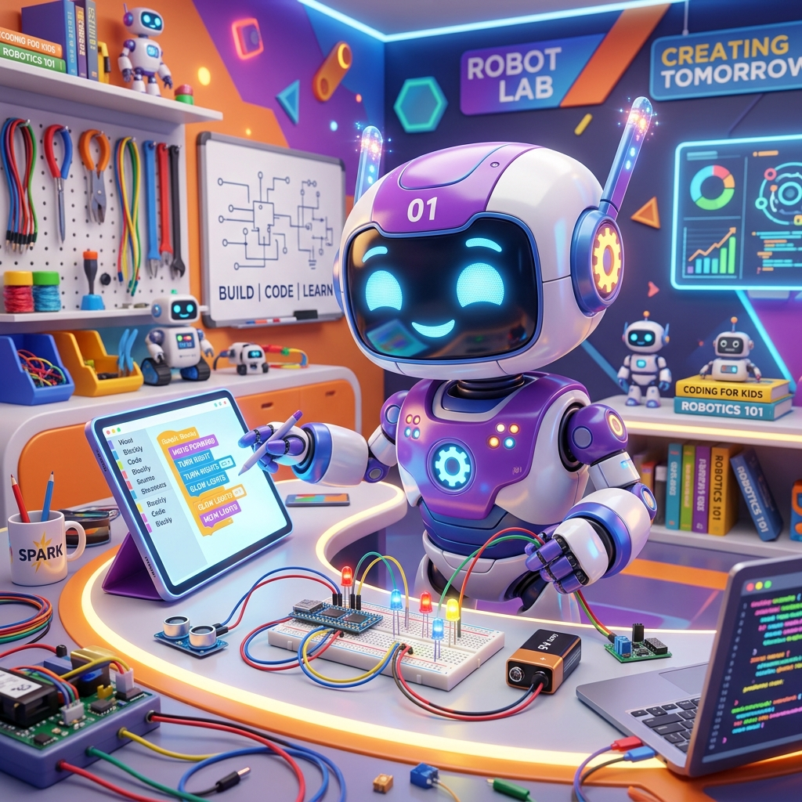

# AI & Robotics Summer Workshop Landing Page

A responsive, high-performance, full-stack landing page for the **AI & Robotics Summer Workshop** (inspired by Kidrove). This project is built using a modern decoupled client-server architecture with React (Vite), Tailwind CSS, Node.js, Express, and MongoDB.



---

## 🌟 Key Features

- **Decoupled Architecture**: Clean division between client (Vite, React 18) and server (Express, MongoDB).
- **Responsive Web Design**: Optimized for Desktop, Tablet, and Mobile devices with modern Tailwind styles.
- **Glassmorphism & Micro-animations**: Premium visual interface with glowing card designs, custom float animations, and transitions.
- **Interactive FAQ Accordion**: Sleek and accessible accordion UI for common questions.
- **Advanced Registration Form**: Integrated with **React Hook Form** for client-side form validation.
- **Real-time API Validation**: Express validators verify all payloads (Name, Email format, 10-digit Phone numbers).
- **Interactive Success Celebration**: Utilizes `canvas-confetti` to fire custom particle explosions on successful registration.
- **API Error Handling**: Captures backend unique constraint violations (e.g. duplicate email registrations) and displays descriptive floating toast alerts.

---

## 📁 Project Structure

```text
ai-robotics-workshop/
├── client/                     # Frontend Project (Vite + React)
│   ├── public/                 # Static assets (Vite icon, etc.)
│   ├── src/
│   │   ├── assets/             # Images (Hero robot illustration)
│   │   ├── components/         # Reusable React components
│   │   │   ├── FAQ.jsx         # Accordion FAQ
│   │   │   ├── Footer.jsx      # Page footer
│   │   │   ├── Hero.jsx        # Landing page Hero section
│   │   │   ├── LoadingSpinner.jsx
│   │   │   ├── Navbar.jsx      # Sticky responsive navigation
│   │   │   ├── RegistrationForm.jsx
│   │   │   ├── SuccessModal.jsx # Celebration popup
│   │   │   ├── Toast.jsx       # Floating notifications
│   │   │   └── WorkshopDetails.jsx
│   │   ├── data/               # Course data & structures
│   │   │   ├── faqData.js
│   │   │   ├── learningOutcomes.js
│   │   │   └── workshopDetails.js
│   │   ├── services/           # Axios HTTP client
│   │   │   └── api.js
│   │   ├── App.jsx             # Main layout combiner
│   │   ├── index.css           # Custom fonts & tailwind overrides
│   │   └── main.jsx            # Entry point
│   ├── index.html
│   ├── package.json
│   ├── postcss.config.js
│   ├── tailwind.config.js
│   └── vite.config.js
│
├── server/                     # Backend API (Node + Express)
│   ├── controllers/            # Controller business logic
│   │   └── enquiryController.js
│   ├── models/                 # Mongoose schema definitions
│   │   └── Enquiry.js
│   ├── routes/                 # Express Router configuration
│   │   └── enquiry.js
│   ├── .env                    # Local environment config (git-ignored)
│   ├── index.js                # App entry & db connection
│   └── package.json
│
├── .gitignore                  # Root Git ignores (node_modules, .env)
└── README.md                   # Main documentation
```

---

## ⚙️ Environment Variables

### Backend Configuration (`server/.env`)
Create a file named `.env` in the `server` directory and configure the following variables:
```env
PORT=5000
MONGO_URI=mongodb://127.0.0.1:27017/ai-robotics-workshop
```

### Frontend Configuration (`client/.env` - Optional)
By default, the client uses a relative path proxy `/api` in local development via `vite.config.js`. If you need to point to a deployed backend directly, configure this in `client/.env`:
```env
VITE_API_URL=http://localhost:5000
```
*(In production, set `VITE_API_URL` to your live Express backend URL.)*

---

## 🚀 Installation & Local Development

Follow these steps to run the application locally.

### Prerequisites
- Node.js (v18.0.0 or higher recommended)
- MongoDB running locally on `mongodb://127.0.0.1:27017`

### Step 1: Clone the Repository
```bash
git clone <repository_url>
cd ai-robotics-workshop
```

### Step 2: Set up the Backend
```bash
cd server
npm install
```
1. Create a `server/.env` file and populate it with your local MongoDB URI.
2. Run the development server:
```bash
npm run dev
```
The backend will boot and listen on `http://localhost:5000`.

### Step 3: Set up the Frontend
Open a new terminal window in the root directory:
```bash
cd client
npm install
npm run dev
```
The Vite development server will spin up on `http://localhost:3000`.

---

## 🌐 Deployment Guide

### Backend Deployment (Render)

Render is ideal for hosting Express servers with MongoDB connections.

1. **Push your code to GitHub**: Create a repository and push the project.
2. **Log into Render**: Access [render.com](https://render.com) and click **New > Web Service**.
3. **Connect Repository**: Link your GitHub repository.
4. **Configure Web Service Parameters**:
   - **Name**: `ai-robotics-workshop-api`
   - **Root Directory**: `server`
   - **Runtime**: `Node`
   - **Build Command**: `npm install`
   - **Start Command**: `node index.js` or `npm start`
5. **Add Environment Variables**:
   - In the **Environment** tab, click **Add Environment Variable**:
     - `PORT`: `5000`
     - `MONGO_URI`: `mongodb+srv://<username>:<password>@cluster.mongodb.net/database?retryWrites=true&w=majority` (Replace with your live MongoDB Atlas connection string).
6. **Deploy**: Render will automatically build and spin up the backend service. Copy your deployed URL (e.g. `https://ai-robotics-workshop-api.onrender.com`).

---

### Frontend Deployment (Vercel)

Vercel is optimized for building and serving Vite React projects.

1. **Log into Vercel**: Access [vercel.com](https://vercel.com) and select **Add New > Project**.
2. **Import Repository**: Link your GitHub repository.
3. **Configure Project Settings**:
   - **Framework Preset**: `Vite` (Vercel auto-detects this).
   - **Root Directory**: `client`
   - **Build Command**: `npm run build`
   - **Output Directory**: `dist`
4. **Configure Environment Variables**:
   - Add a new environment variable:
     - `VITE_API_URL`: `https://your-backend-url.onrender.com` (Use the Render service URL copied above without a trailing slash).
5. **Deploy**: Click **Deploy**. Vercel will build your static bundle and serve it on a secure `https` subdomain.

---

## 📝 Workshop Details Summary

- **Title**: AI & Robotics Summer Workshop
- **Age Group**: 8–14 Years
- **Duration**: 4 Weeks (Interactive Live Sessions)
- **Mode**: Online
- **Fee**: ₹2,999 (All Inclusive)
- **Start Date**: 15 July 2026